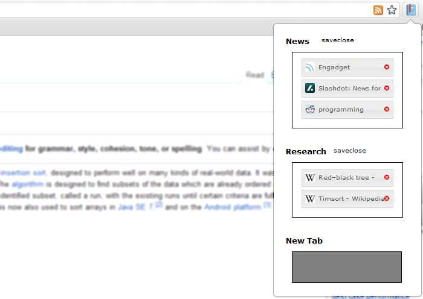

Bookmarked Tabs is an attempt to create a Chrome extension that replicates the main functionality provided by the Firefox feature dubbed Panorama or Tab Candy.

Objectives
---
Allow users to:
* Group tabs into logical groups
* See all tabs and reorder them quickly and easily
* Save and restore tab groups
* Find saved tabs
* Sync tabs between multiple computers

I am aiming to implement these features by displaying all tabs/saved items within windows/groups in a page with JavaScript to enable actions. All pages (active or saved) will be stored as bookmarks under a special "Bookmarked Tabs" folder. The cross-computer syncing will be achieved by leveraging Chrome's bookmark sync feature.

Current Status
---
* Under active development
* Shows all tabs in extension page with live updating
* Allows tabs to be moved/reordered between open windows or into a new window
* Allows tabs to be closed in groups
