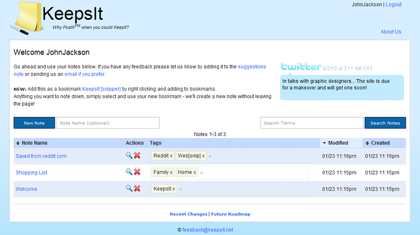

The KeepsIt website is aimed at being the best place for you to keep notes. This projects started as a project to teach a friend PHP but expanded quickly. Development of KeepsIt halted after discovering a similar service offered by [Evernote](http://evernote.com){:target="_blank"}.

During development features were added daily, selected from a prioritized list stored within KeepsIt itself.

Features
---
* Plain and rich-text storage
* reCAPTCHA on signup
* Sharing and Privacy controls
* Search
* Labels
* Mobile Website (optimized for Phones and Kindle Reader)
* Bookmarklet to create a note from content on any website
* Daily backups of the DB
* Share notes via SMS or Email
* Stores change revisions

Objectives
---
* Initially used as teaching project
* Sharpen PHP skills
* Play with AJAX
* Learn <em>many</em> other technologies (see features above for examples)
* Personal and Public use

Current Status
---
* Not maintained
* Still mostly functional

Website
----
[http://keepsit.net](http://keepsit.net){:target="_blank"}
