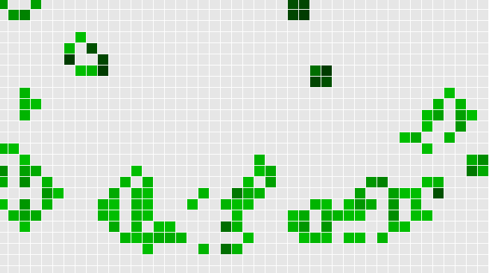

This is a JavaScript + Canvas implementation of [Conway's Game of Life](http://en.wikipedia.org/wiki/Conway%27s_Game_of_Life). This is a very small "game" I wrote to play around with the design that could be used for the future [Wall Art project](../living) as well as having a quick spin with Canvas and test the speeds of different browsers.

The game features a few different options for map dimensions, tile size, updating frequency, and allows the user to manually toggle the state of a tile (mouse click).

Objectives
---
* Prototype for Wall Art project
* Learn Canvas
* To have fun with Conway's Game of Life
* To learn CoffeeScript

Current Status
---
* Served purpose
* May be revived and expanded for Wall Art prototype

Links
---
* Latest (2012) version written in CoffeeScript on Git Hub: [Repo](https://github.com/thenickreynolds/gameoflife){:target="_blank"} and [Demo](http://thenickreynolds.github.io/gameoflife){:target="_blank"}
* 2012 Demons of Cyclic Space written in CoffeeScript: [Demo](DemonsOfCyclicSpace.coffeescript.html){:target="_blank"}
* 2011 version (not OO) written in JavaScript: [Demo](gameoflife.html){:target="_blank"}
