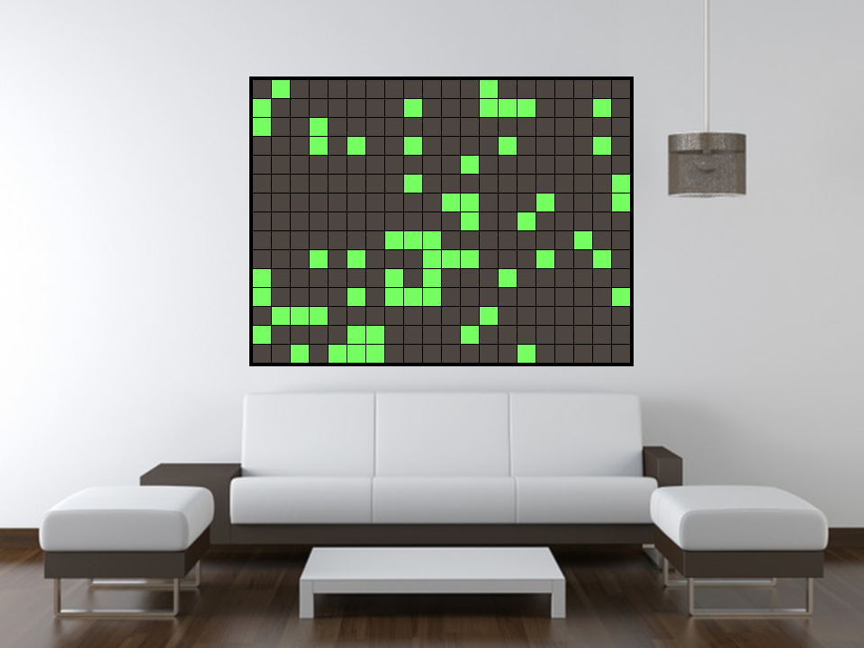
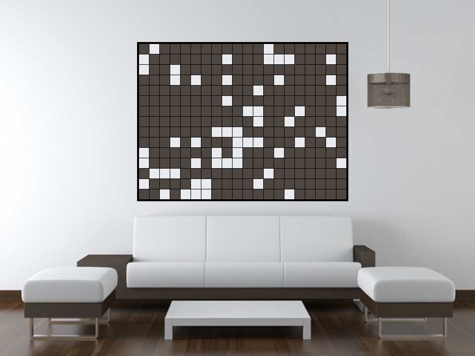
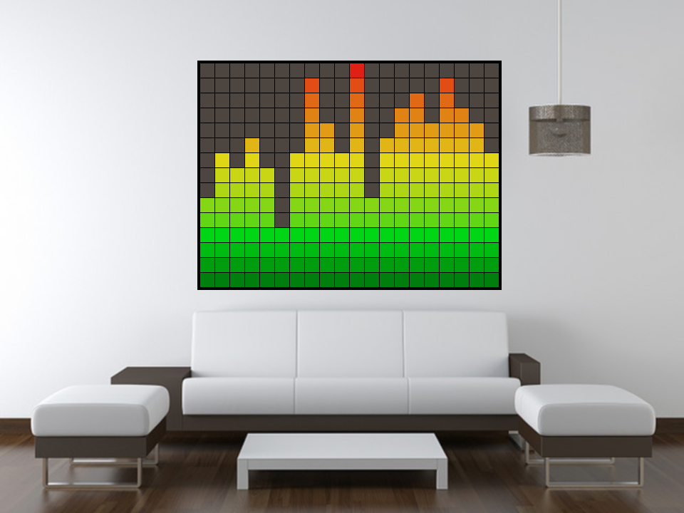

Living Art is a project I have done preliminary research for and plan to implement "some time" in the future as a hobby project. The piece will consist of a 2D array of LED illuminated cells with the light diffused to a larger square using a white opaque cover. The finished product would be hung in a lounge and would provide a dynamic display. The modes for the piece would include (but not be limited to):
* Conway's Game of Life (see [Game of Life project](../life)) with a variable tick time, default of 1 day
* Equalizer to be used during parties and other social events
* Visualizations with variable ticks and seeds
* Clock mode
* ...

Ideally the piece would use RGB LEDs however this would increase the circuit complexity (and required speed of the CPU greatly. Additionally it would be great to be able to control each cell individually however once again this would increase complexity significantly.

Objectives
---
* Build a hang-able piece within a frame
* Hide all wires
* Diffuse light sources equally across each cell
* Separate cells to prevent light "bleeding"
* Controlled by one re-programmable micro-controller
* Provide controls and LCD screen for switching modes

Status
---
* Currently in design/planning
* Long term project
* Investigating components/circuits

Mock Displays
---

Game of Life (Green)

Game of Life (White)

Equalizer

