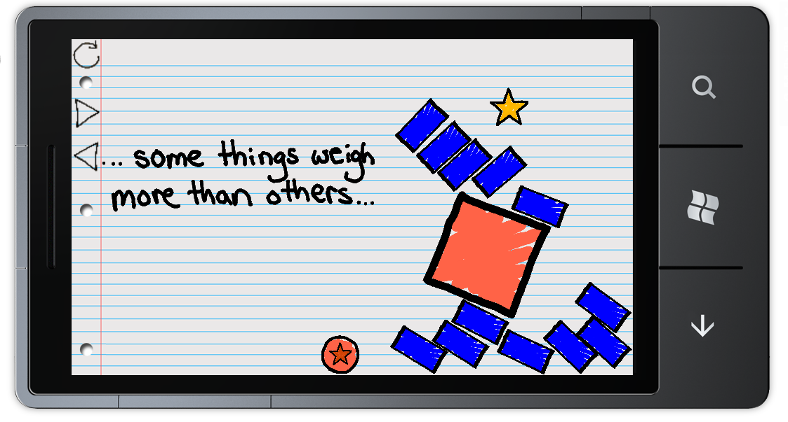

Pen and Paper is a 2D puzzle game with realistic physics. It is written in C# for the Windows Phone 7 and uses the Box2D physics library (the same engine used in Angry Birds).

Users are thrown right into the game and have to use the principles of physics to complete each level. The earlier levels are designed to teach the game mechanics without interrupting gameplay while the later levels are designed to challenge the player with more complicated maps.

The game was released in January of 2011 and reached over 10k downloads within the first year.

This was a joint project between myself and [Jason Brewer](http://inspiredalacrity.com){:target="_blank"}.

Objectives
---
* Try the C# XNA framework
* Experience modern mobile development (Windows Phone 7)
* Play around with the Box2D physics library
* Learn the basics of game engine, level, and artwork creation

Current Status
---
* Windows Phone marketplace has been taken down
* Had > 10k downloads
