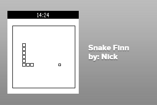

As part of a Pebble hackathon at Facebook I implemented Snake ala the original Nokia phone application. This was a 4 hour hackathon with beer.

Snake was features on a few tech sites such as [Tech Crunch](http://techcrunch.com/2013/03/20/pebble-firmware-update-1-9-delivers-a-non-watchface-app-the-classic-game-of-snake/){:target="_blank"} [(Archive)](Pebble-TechCrunch.pdf){:target="_blank"}.

> Pebble has just updated its smart watch, complete with a much-improved interface and new watchfaces. But the exciting thing here is the addition of a game you likely remember from the days when your cell phone’s screen wasn’t much different from the Pebble’s itself – Snake.
> 
> [...] The Snake game is the highlight of the show [...]

The code is available on [GitHub](https://github.com/thenickreynolds/pebblesnake){:target="_blank"}.
