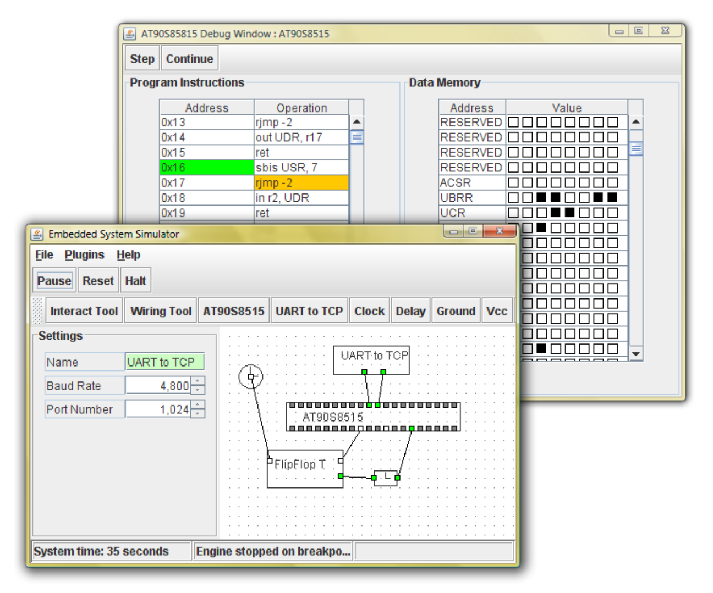

This project is the result of my thesis for the final year of my Bachelor of Engineering (Software) at the University of Queensland, Australia.

Abstract
---
Software development for embedded systems is often complicated by the lack of a standard set of debugging tools once code has been programmed to a microchip. In an effort to afford an environment in which these debugging tools can be provided, it is the aim of this thesis to enable the simulation of these systems. This reveals the hidden internal operations of the microcontroller thus allowing a these tools to be provided.

In order to fully debug these systems it must be possible not only to simulate the microprocessor but the peripherals connected to it also.

This is not the first approach to simulate embedded systems however it is the purpose of this thesis to develop a freely distributable, platform independent, extendable, easy-to-use, fast simulation environment with the ability to emulate the specific hardware required by the university.

The requirements and approach of creating such a system is explored through the analysis of current simulation techniques and existing technologies. Also included is an expected project schedule, breakdown of required tasks, and risk assessment.

Objectives
---
* Develop a simulation environment that students could use to prototype, develop and debug projects
* Reduce the need for lab time for Engineering students
* Provide an identical experience running software on microprocessors
* Grant additional debugging options not currently available (see internal state of chip, set breakpoints, step through code)

Current Status
---
* In its final state this was usable as a debugging platform
* Basis for the current solution in place today
* Runs as of 3/10/12, Java 6.0

Links
---
* [Thesis document](Thesis.pdf){:target="_blank"}
* [Project code](Embedded-Systems-Simulator-Src.tar){:target="_blank"}
